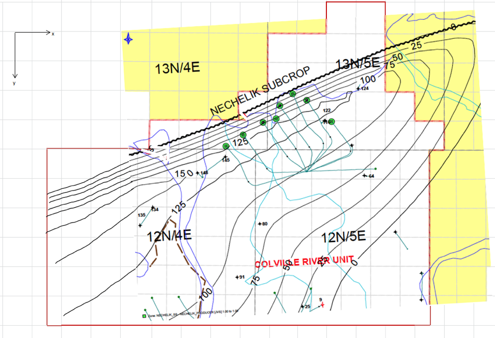
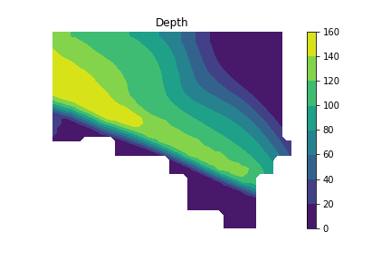

# Project 1 — Reservoir depth from a digitized topographic map

Project 1 is the cumulative project for the course. There is **no new concept and no
new agent exercise** here: the map, the `Nechelik` helper class, the environment and
the submission script all ship with this repository. Your job is to do the engineering
independently and finish the project successfully.

## 1. The map



The field is 54 blocks wide and 22 blocks tall, and each block on the map spans 523 ft.
Digitize the topographic depth contours with the web-based
[WebPlotDigitizer](https://apps.automeris.io/wpd/):

- [YouTube tutorial](https://youtu.be/AJIM_Cq2WcU) — the interface has changed a little
  since the recording, but the workflow is the same.
- [WebPlotDigitizer tutorial](https://automeris.io/WebPlotDigitizer/tutorial.html) —
  reference documentation for the tool.

Digitize the field boundary and each depth contour ($0, 25, 50, 75, 100, 125$ and
$150$ ft) as separate datasets and export each of them as CSV.

## 2. Digitized data (`Nechelik_Data.csv`)

Assemble the exported datasets into a single file in the repository root named exactly
`Nechelik_Data.csv`, with two header rows and 16 columns:

- Row 1: `boundary` for the first column pair, then the contour value (`0`, `25`,
  `50`, `75`, `100`, `125`, `150`) for each following pair.
- Row 2: `X`,`Y` for every column pair.
- Data rows: the boundary points, then each contour's digitized `X`,`Y` points. The
  datasets have different lengths, so short columns are padded with empty cells.

The reader labels the column pairs positionally as `boundary`, then `C0` … `C150`, so
the column order above is what matters, not the exact header text.

Use the left edge of the field as the $x=0$ datum and the top of the field as the
$y=0$ datum, and keep every dataset in the same coordinate system.

## 3. Implementation (`project1.py`)

The `Nechelik` class is **provided and complete**. Read it before you plan; it owns
the file parsing and the interpolation steps:

- `setup_df(filename)` — read the two header rows and label the 16 columns
  `boundary`, `C0`, `C25`, `C50`, `C75`, `C100`, `C125`, `C150`.
- `get_points_and_values()` — flatten the digitized contours into `points` (an
  $N \times 2$ array of `X`,`Y`) and `values` (the contour depth in ft, one entry per
  point).
- `create_grid()` — build the block-centred grid (see the equations below) and set
  `self.eps`.
- `interpolate()` — cubic `scipy.interpolate.griddata` interior interpolation.
- `extrapolate()` — nearest-neighbour `griddata` call that fills the rest of the
  domain from the already interpolated values.
- `set_boundary()` — clamp negative depths to $0.0$ and mask everything outside the
  digitized boundary with `nan`.
- `plot()` — a convenience `contourf` plot for sanity checking only.

You implement `extrapolate_depth(filename, Nx, Ny)`, which returns the depth as an
$N_y \times N_x$ array, one value per block centre. Drive the provided steps in the
documented order.

### Grid definitions

With $x_{min}, x_{max}, y_{min}, y_{max}$ taken from the digitized boundary,

$$
\Delta x = \frac{x_{max} - x_{min}}{N_x}, \qquad
\Delta y = \frac{y_{max} - y_{min}}{N_y},
$$

the block centres are

$$
x_i = x_{min} + \frac{\Delta x}{2} + i\,\Delta x, \quad i = 0 \dots N_x - 1,
\qquad
y_j = y_{min} + \frac{\Delta y}{2} + j\,\Delta y, \quad j = 0 \dots N_y - 1,
$$

and the boundary buffer used for masking is

$$
\varepsilon = \min\left(\tfrac{1}{2}\Delta x, \tfrac{1}{2}\Delta y\right).
$$

### Depth construction

1. Interpolate the digitized contours with `griddata(..., method='cubic')`. This is
   accurate inside the [convex hull](https://en.wikipedia.org/wiki/Convex_hull) of the
   digitized data and `nan` everywhere else.
2. Use the interpolated points as the data for a second `griddata(..., method='nearest')`
   call to extend the field to the domain boundary.
3. Replace unphysical values, i.e. negative depths, with $0.0$.
4. Mask with `nan` every block centre outside the digitized boundary, buffered inward
   by $\varepsilon$.

A correct result looks like this:



Plots are useful for checking that your result is *sane*, but the values are what is
graded. `extrapolate_depth` must not contain plot commands.

## 4. Deliverables

- `Nechelik_Data.csv` — your digitization of the map.
- `project1.py` — the completed `extrapolate_depth` function.

Everything else is protected, including the provided `Nechelik` class, `README.md`,
`submission-policy.json`, the images, the environment and the workflows.

## 5. Submit

There is no local test suite for this project. Your work is graded by the instructor
suite after you submit, so check it yourself before you do:

```bash
git diff --check
```

Confirm that `Nechelik_Data.csv` is in the repository root, that
`extrapolate_depth('Nechelik_Data.csv', 54, 22)` returns a $22 \times 54$ array, and
that the result is physically sensible on the contour plot.

When you are ready, ask the agent to **submit project 1**. Review its dry run, then
explicitly authorize execution. The protected `submission-policy.json` owns the exact
deliverable paths.
